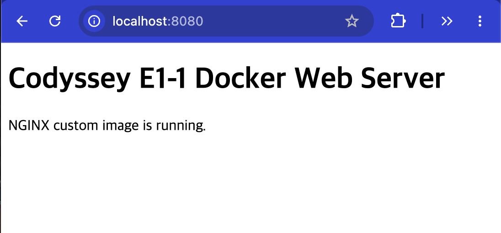
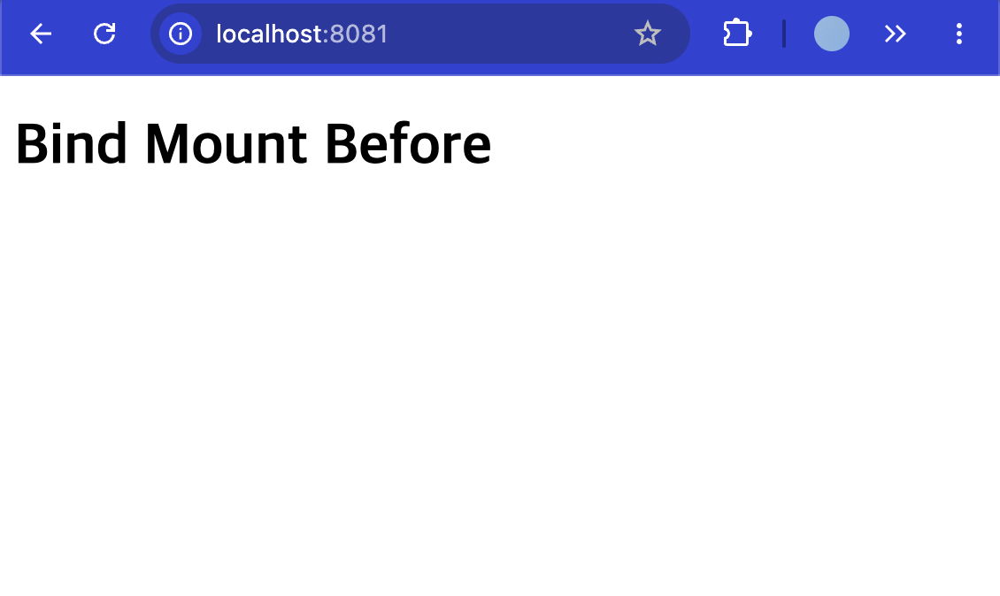
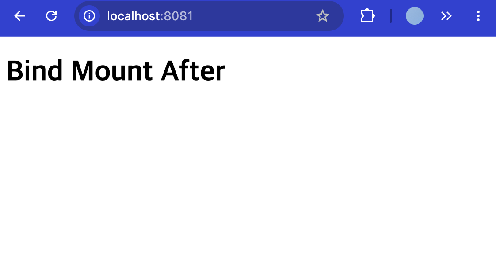
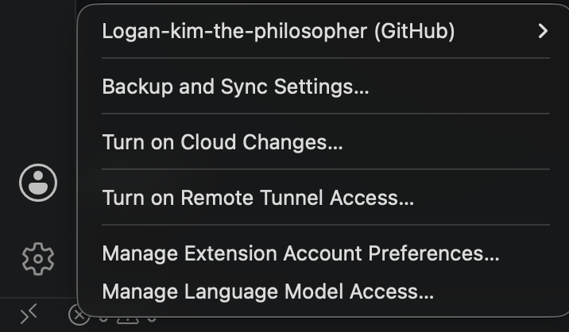

# 환경 세팅

- 과제 코드: E1-1
- 발표 링크: [발표용 HTML](https://Logan-kim-the-philosopher.github.io/codyssey/)

## 과제 요약

미션 소개 개발은 코드를 작성하는 순간이 아니라, 환경을 세팅하는 순간부터 시작됩니다. 터미널, Docker, Git. 이 세 가지를 직접 손으로 세팅해 본 경험이 있어야, 비로소 '개발을 시작한다'는 말이 실감 납니다. 도구를 다루는 법을 아는 것이 개발자로서의 첫 번째 기반입니다. 개발 워크스테이션은 코드가 "내 컴퓨터에서만" 돌아가는 문제를 줄이고, 팀원 누구나 같은 방식으로 실행, 배포, 디버깅할 수 있는 환경 구성을 목표로 합니다. 이 과정에서 핵심 도구인 리눅스 CLI(터미널), Docker(컨테이너), Git/GitHub(버전 관리 및 협업)를 함께 사용합니다. 이 도구들은 로컬 개발 환경 세팅, 재현 가능한 실행 환경 공유, 협업 기반 소스코드 관리 같은 상황에서 널리 활용됩니다. 이 미션에서는 터미널로 작업 디렉토리와 권한을 정리한 뒤, Docker를 설치 및 점검하고 컨테이너를 실행/관리합니다. 이어서 간단한 웹 서버를 Dockerfile로 컨테이너화하고, 포트 매핑으로 접속을 확인하며, 바인드 마운트/볼륨으로 "변경 반영"과 "데이터 영속성"을 직접 검증합니다. 단순히 따라 치는 실습이 아니라, 실행 결과(로그/접속/데이터 유지)로 핵심 흐름을 확인합니다. 또한, 이미지와 컨테이너의 분리, 격리된 실행 환경, 포트·스토리지 연결 방식이라는 구조적 원칙을 적용해 "왜 이런 설계가 필요한지"를 설명 가능한 형태로 정리합니다. 같은 서비스를 여러 번 실행해도 재현되는 환경을 만드는 사고방식을 경험하는 것이 목표입니다. 이 경험은 이후 리눅스 트러블슈팅, CI/CD 파이프라인, 클라우드 배포/운영 등으로 자연스럽게 확장됩니다. — (서울 추가 내용) 서울캠퍼스 환경에서는 시스템 보안 정책상 sudo 권한 사용이 제한될 수 있습니다. 이로 인해 일반적인 방식으로 Docker를 직접 설치하거나 데몬을 제어하는 데 제약이 있습니다. 이 문제를 해결하기 위해, 본 과정에서는 OrbStack을 활용합니다. OrbStack은 Docker Desktop과 유사한 컨테이너 실행 환경을 제공하는 애플리케이션으로, 별도의 sudo 권한 없이도 컨테이너를 실행하고 관리할 수 있도록 지원합니다. 교육생은 다음과 같은 방식으로 OrbStack을 활용하게 됩니다:

## 요구사항

- 미션 소개 개발은 코드를 작성하는 순간이 아니라, 환경을 세팅하는 순간부터 시작됩니다. 터미널, Docker, Git. 이 세 가지를 직접 손으로 세팅해 본 경험이 있어야, 비로소 '개발을 시작한다'는 말이 실감 납니다. 도구를 다루는 법을 아는 것이 개발자로서의 첫 번째 기반입니다. 개발 워크스테이션은 코드가 "내 컴퓨터에서만" 돌아가는 문제를 줄이고, 팀원 누구나 같은 방식으로 실행, 배포, 디버깅할 수 있는 환경 구성을 목표로 합니다. 이 과정에서 핵심 도구인 리눅스 CLI(터미널), Docker(컨테이너), Git/GitHub(버전 관리 및 협업)를 함께 사용합니다. 이 도구들은 로컬 개발 환경 세팅, 재현 가능한 실행 환경 공유, 협업 기반 소스코드 관리 같은 상황에서 널리 활용됩니다. 이 미션에서는 터미널로 작업 디렉토리와 권한을 정리한 뒤, Docker를 설치 및 점검하고 컨테이너를 실행/관리합니다. 이어서 간단한 웹 서버를 Dockerfile로 컨테이너화하고, 포트 매핑으로 접속을 확인하며, 바인드 마운트/볼륨으로 "변경 반영"과 "데이터 영속성"을 직접 검증합니다. 단순히 따라 치는 실습이 아니라, 실행 결과(로그/접속/데이터 유지)로 핵심 흐름을 확인합니다. 또한, 이미지와 컨테이너의 분리, 격리된 실행 환경, 포트·스토리지 연결 방식이라는 구조적 원칙을 적용해 "왜 이런 설계가 필요한지"를 설명 가능한 형태로 정리합니다. 같은 서비스를 여러 번 실행해도 재현되는 환경을 만드는 사고방식을 경험하는 것이 목표입니다. 이 경험은 이후 리눅스 트러블슈팅, CI/CD 파이프라인, 클라우드 배포/운영 등으로 자연스럽게 확장됩니다. — (서울 추가 내용) 서울캠퍼스 환경에서는 시스템 보안 정책상 sudo 권한 사용이 제한될 수 있습니다. 이로 인해 일반적인 방식으로 Docker를 직접 설치하거나 데몬을 제어하는 데 제약이 있습니다. 이 문제를 해결하기 위해, 본 과정에서는 OrbStack을 활용합니다. OrbStack은 Docker Desktop과 유사한 컨테이너 실행 환경을 제공하는 애플리케이션으로, 별도의 sudo 권한 없이도 컨테이너를 실행하고 관리할 수 있도록 지원합니다. 교육생은 다음과 같은 방식으로 OrbStack을 활용하게 됩니다:
- OrbStack 애플리케이션을 실행하면 내부적으로 Docker 엔진이 함께 구동됩니다.
- 이후 터미널에서는 기존과 동일하게 docker 명령어를 사용할 수 있습니다.
- 예: docker run, docker ps, docker build 등
- 최종 결과물 다음 조건을 만족하는 개발 워크스테이션 구축 결과물을 완성한다.
- 제출 저장소(GitHub Repository)
- 공개(또는 과제 제출 규칙에 맞는 권한)로 생성한다.
- 저장소 링크만으로 아래 산출물 전부를 확인할 수 있어야 한다.
- 기술 문서(README.md 등)
- 프로젝트 개요(미션 목표 요약)
- 실행 환경(OS/쉘/터미널, Docker 버전, Git 버전)
- 수행 항목 체크리스트(터미널/권한/Docker/Dockerfile/포트/볼륨/Git/GitHub)
- 검증 방법(어떤 명령으로 무엇을 확인했는지) + 결과 위치 링크
- 트러블슈팅 2건 이상(문제 → 원인 가설 → 확인 → 해결/대안)
- 기술 문서만 읽어도 전체 수행 내용을 파악할 수 있어야 한다.
- 터미널 조작 로그
- 터미널에서 수행한 핵심 명령과 출력 결과를 기술 문서에 기록한다.
- Docker 운영/검증 로그
- docker --version, docker info 등 설치·점검 결과
- docker images, docker ps -a, docker logs, docker stats 등 운영 명령 실행 흔적
- Dockerfile 기반 웹 서버 컨테이너
- 웹 서버 소스코드(예: app/ 또는 src/)
- Dockerfile
- 빌드/실행 명령 및 결과 로그(터미널 스크린샷 가능)
- 포트 매핑 접속 성공 증거(스크린샷 또는 로그)
- 포트 매핑 접속 증거
- p <host_port>:<container_port>로 실행 후, 브라우저 접속 화면(주소창 포함)을 기술 문서에 첨부한다.
- 바인드 마운트 반영 + 볼륨 영속성 증거
- 바인드 마운트: 실행 명령 + 호스트 변경 전/후 비교
- Docker 볼륨: 생성/연결/검증 명령 + 컨테이너 삭제 전/후 비교
- Git 설정 및 GitHub/VSCode 연동 증거
- Git 사용자 정보·기본 브랜치 설정 후, VSCode에서 GitHub 로그인 및 저장소 연동 완료
- 민감한 개인 정보(ID/PW, 토큰 등)가 포함되지 않도록 주의한다.
- 과제 목표 이 과제를 마친 후, 학습자는 아래를 스스로 설명할 수 있어야 한다.
- 절대 경로와 상대 경로의 차이를 예시를 들어 설명할 수 있다.
- 파일 권한의 의미(r/w/x)와 755, 644 같은 표기가 어떤 규칙으로 해석되는지 설명할 수 있다.
- 기존 Dockerfile을 기반으로 “커스텀 이미지”를 만들 수 있다.
- 포트 매핑이 필요한 이유를 설명할 수 있다.
- Docker 볼륨(영속 데이터)을 설명할 수 있다.
- Git과 GitHub의 역할 차이(로컬 버전관리 vs 원격 협업 플랫폼)를 설명할 수 있다.
- 기능 요구 사항 다음 요구사항을 모두 만족해야 한다.
- 제출 저장소 및 기술 문서
- GitHub Repository 링크로 제출한다.
- 기술 문서(README.md 등)는 아래 내용을 반드시 포함한다.
- 모든 수행 결과는 “기술 문서(README.md 등)”에서 확인 가능해야 한다.
- 프로젝트 개요(미션 목표 요약)
- 실행 환경(OS/쉘/터미널, Docker 버전, Git 버전)
- 수행 항목 체크리스트(터미널/권한/Docker/Dockerfile/포트/마운트/볼륨/Git/GitHub)
- 검증 방법(어떤 명령으로 무엇을 확인했는지) + 결과 위치/증거 링크
- 기술 문서 내 명령/출력은 코드블록으로 정리한다.
- 터미널 조작 로그 기록
- 다음 작업을 터미널로 수행하고, 명령어 + 출력 결과를 기술 문서에 기록한다.
- 현재 위치 확인, 목록 확인(숨김 파일 포함), 이동, 생성, 복사, 이동/이름변경, 삭제
- 파일 내용 확인, 빈 파일 생성
- 권한 실습 및 증거 기록
- 권한을 확인/변경하는 명령을 수행하고, 변경 전/후 비교를 기술 문서에 남긴다.
- 최소 요구: 파일 1개, 디렉토리 1개에 대해 권한 변경 실험을 수행한다.
- Docker 설치 및 기본 점검
- Docker 버전 확인 결과를 기록한다. (docker --version)
- Docker 데몬 동작 여부 확인 결과를 기록한다. (docker info 또는 동등 점검)
- Docker 기본 운영 명령 수행
- 이미지: 다운로드/목록 확인 (예: docker images)
- 컨테이너: 실행/중지/목록 확인 (예: docker ps, docker ps -a)
- 운영: 로그 확인 (예: docker logs), 리소스 확인 (예: docker stats)
- 수행 명령과 출력 결과를 기술 문서에 남긴다.
- 컨테이너 실행 실습
- hello-world 실행 성공을 기록한다.
- ubuntu 컨테이너를 실행하고 내부 진입 후 간단 명령(예: ls, echo) 수행 결과를 기록한다.
- 컨테이너 종료/유지(attach/exec 등)의 차이를 스스로 관찰하고 간단히 정리한다.
- 기존 Dockerfile 기반 커스텀 이미지 제작
- 아래 방식 중 하나를 선택하여 기존 Dockerfile/이미지 기반의 커스텀 이미지를 만든다.
- (A) 웹 서버 베이스 이미지 활용(예: NGINX/Apache 등) + 정적 콘텐츠/설정만 교체
- (B) Linux 베이스 이미지(예: ubuntu/alpine 등) + 기본 기능(패키지/사용자/환경변수/헬스체크 등) 추가
- 제작 결과는 아래 조건을 만족해야 한다.
- 커스텀 이미지 빌드 성공 및 컨테이너 실행 성공
- 기술 문서에 다음을 포함한다.
- 어떤 “기존 베이스(이미지/예시 Dockerfile)”를 선택했는지
- 내가 적용한 커스텀 포인트 각각의 목적(간단 요약)
- 빌드/실행 명령 + 핵심 결과(출력/스크린샷)
- 포트 매핑 및 접속 증거
- 브라우저 접속 화면(또는 curl 응답)을 기술 문서에 첨부한다.
- Docker 볼륨 영속성 검증
- Docker 볼륨을 생성하고 컨테이너에 연결한다.
- 컨테이너 삭제 전/후로 데이터를 확인하여 데이터가 유지됨을 증명한다.
- 기술 문서에 생성/연결/검증 절차(명령+출력)를 포함한다.
- Git 설정 및 GitHub 연동
- * Git 사용자 정보/기본 브랜치 설정을 완료하고 git config --list 결과를 기록한다.
- * GitHub 로그인 및 저장소 연동을 완료하고, 연동 증거(스크린샷 등)를 기술 문서에 첨부한다.
- 보안 및 개인정보 보호
- * 기술 문서/로그/스크린샷에 토큰, 비밀번호, 개인키, 인증 코드 등이 포함되지 않도록 마스킹한다.
- * 의심되는 민감정보가 노출된 경우, 즉시 히스토리/문서에서 제거하고 재발급 절차를 수행한다 (가능한 범위에서).
- 보너스 과제 (선택)
- Docker Compose 기초
- docker-compose.yml의 기본 구조를 학습하고, 단일 서비스를 Compose로 실행한다.
- 배움 포인트: 컨테이너 실행 명령이 “문서화된 실행 설정”으로 바뀌는 이유
- Docker Compose 멀티 컨테이너
- 웹 서버 + (임의의 보조 서비스) 2개 이상을 Compose로 함께 실행한다.
- 컨테이너 간 네트워크 통신이 가능한지 확인한다.
- 배움 포인트: 네트워크/서비스 디스커버리 개념 맛보기
- Compose 운영 명령어 습득
- up, down, ps, logs를 사용해 실행/종료/상태/로그를 관리한다.
- 배움 포인트: 운영 관점의 “상태 확인 루틴” 만들기
- 환경 변수 활용
- Dockerfile 또는 Compose에서 환경 변수를 주입해 서버 포트/모드를 바꿔본다.
- 배움 포인트: 설정과 코드의 분리
- GitHub SSH 키 설정
- HTTPS 대신 SSH로 푸시가 가능하도록 키를 등록하고 동작을 확인한다.
- 배움 포인트: 인증 방식 차이와 보안 습관 개발환경
- 개발 환경 N/A 제약조건
- 제약 사항
- 제출 방식
- 제출은 GitHub Repository 링크로 진행한다.
- 기술 문서(README.md 등)에 수행 로그와 증거가 모두 포함되어야 한다. (별도 파일로 분리하는 것은 가능하나, README에서 링크로 접근이 가능해야 한다.)
- 실행 방식
- 모든 작업은 터미널(CLI) 기반으로 수행한다.
- Dockerfile은 직접 작성해야 한다.
- 포트 매핑과 마운트/볼륨은 직접 설정하고 동작을 검증해야 한다.
- 증거 수집 규칙
- 캡처/로그에는 “명령어 입력”과 “출력 결과”가 함께 포함되어야 한다.
- 브라우저 접속 증거는 주소창(포트 포함)과 응답 화면이 함께 보이도록 한다.
- 민감정보는 로그/이미지에 남기지 않는다(마스킹 필수).
- 재현성
- README만 보고도 평가자가 동일 절차를 따라 결과물을 확인할 수 있어야 한다.
- 특정 개인 PC에 종속된 경로/설정이 있다면, 대체 방법 또는 주의사항을 함께 기록한다. Test Case
- 결과 예시 아래는 참고 예시다. 그대로 제출하면 안 된다. 실제 폴더명/포트/로그 문구/구성은 달라도 된다. * 기술 문서(README) 구성 예시
## 1) 실행 환경
- - OS: Ubuntu 22.04
- - Shell: bash
- - Docker: 26.x
- - Git: 2.x *
- ## 2) 수행 체크리스트
- - [x] 터미널 기본 조작 및 폴더 구성
- - [x] 권한 변경 실습
- - [x] Docker 설치/점검
- - [x] hello-world 실행
- - [x] Dockerfile 빌드/실행
- - [x] 포트 매핑 접속(2회)
- - [x] 바인드 마운트 반영
- - [x] 볼륨 영속성
- - [x] Git 설정 + VSCode GitHub 연동 *
- ## 3) 수행 로그(발췌)
- bash$ pwd
- /home/user
- $ mkdir -p ~/codyssey/practice
- $ ls -la
- ... * * * * Dockerfile 커스텀 예시
FROM nginx:alpine
- LABEL org.opencontainers.image.title="my-custom-nginx"
- ENV APP_ENV=dev
- COPY site/ /usr/share/nginx/html/ * * * Docker 포트 매핑 실행 로그 예시
$ docker build -t my-web:1.0 .
- $ docker run -d -p 8080:5000 --name my-web-8080 my-web:1.0
- $ curl <http://localhost:8080>
- Hello *
- $ docker run -d -p 8081:5000 --name my-web-8081 my-web:1.0
- $ curl <http://localhost:8081>
- Hello * * * 볼륨 영속성 예시
$ docker volume create mydata
- $ docker run -d --name vol-test -v mydata:/data ubuntu sleep infinity
- $ docker exec -it vol-test bash -lc "echo hi > /data/hello.txt && cat /data/hello.txt"
- hi
- $ docker rm -f vol-test *
- $ docker run -d --name vol-test2 -v mydata:/data ubuntu sleep infinity
- $ docker exec -it vol-test2 bash -lc "cat /data/hello.txt"
- hi *

## 학습 설계

- 터미널을 내 말로 설명하고 실제 과제에서 어디에 쓰이는지 확인한다.
- 명령어을 내 말로 설명하고 실제 과제에서 어디에 쓰이는지 확인한다.
- 현재 작업 디렉터리을 내 말로 설명하고 실제 과제에서 어디에 쓰이는지 확인한다.
- 파일을 내 말로 설명하고 실제 과제에서 어디에 쓰이는지 확인한다.
- 디렉터리을 내 말로 설명하고 실제 과제에서 어디에 쓰이는지 확인한다.
- README을 내 말로 설명하고 실제 과제에서 어디에 쓰이는지 확인한다.
- GitHub Pages을 내 말로 설명하고 실제 과제에서 어디에 쓰이는지 확인한다.
- Git을 내 말로 설명하고 실제 과제에서 어디에 쓰이는지 확인한다.
- repository을 내 말로 설명하고 실제 과제에서 어디에 쓰이는지 확인한다.
- commit을 내 말로 설명하고 실제 과제에서 어디에 쓰이는지 확인한다.
- branch을 내 말로 설명하고 실제 과제에서 어디에 쓰이는지 확인한다.
- git status을 내 말로 설명하고 실제 과제에서 어디에 쓰이는지 확인한다.
- git add을 내 말로 설명하고 실제 과제에서 어디에 쓰이는지 확인한다.
- git commit을 내 말로 설명하고 실제 과제에서 어디에 쓰이는지 확인한다.
- git push을 내 말로 설명하고 실제 과제에서 어디에 쓰이는지 확인한다.
- Docker을 내 말로 설명하고 실제 과제에서 어디에 쓰이는지 확인한다.
- Dockerfile을 내 말로 설명하고 실제 과제에서 어디에 쓰이는지 확인한다.
- image을 내 말로 설명하고 실제 과제에서 어디에 쓰이는지 확인한다.
- container을 내 말로 설명하고 실제 과제에서 어디에 쓰이는지 확인한다.
- docker build을 내 말로 설명하고 실제 과제에서 어디에 쓰이는지 확인한다.
- docker run을 내 말로 설명하고 실제 과제에서 어디에 쓰이는지 확인한다.
- docker ps을 내 말로 설명하고 실제 과제에서 어디에 쓰이는지 확인한다.
- port을 내 말로 설명하고 실제 과제에서 어디에 쓰이는지 확인한다.

## 실습 과정

### 터미널 기본 조작 / 파일과 디렉토리 생성/내용 확인/복사/이름변경/삭제

- 목적: 터미널 기본 명령으로 현재 위치 확인, 숨김 항목 포함 목록 확인, 폴더/파일 생성, 내용 확인, 복사, 이름변경, 삭제를 수행하고 증거를 남긴다.
- 액션: pwd, ls -la, mkdir -p, touch, printf, cat, cp, mv, rm 수행
- 실행 명령: cd codyssey/assignments/e1-1/work; pwd; ls -la; mkdir -p terminal-practice/subdir; touch terminal-practice/empty.txt; printf "Codyssey terminal practice\n" > terminal-practice/note.txt; cat terminal-practice/note.txt; cp terminal-practice/note.txt terminal-practice/subdir/note-copy.txt; mv terminal-practice/subdir/note-copy.txt terminal-practice/subdir/renamed-note.txt; rm terminal-practice/empty.txt; ls -la terminal-practice; ls -la terminal-practice/subdir; cat terminal-practice/subdir/renamed-note.txt
- 핵심 출력: 작업 위치가 codyssey/assignments/e1-1/work로 확인됨. terminal-practice/subdir 생성. empty.txt는 0바이트 빈 파일로 생성됨. note.txt는 27바이트 파일이며 cat 결과 Codyssey terminal practice 출력. note.txt를 subdir로 복사 후 renamed-note.txt로 이름 변경. empty.txt 삭제 후 최종 목록에서 보이지 않음. renamed-note.txt 내용은 원본과 동일함.
- 결과 해석: pwd와 ls -la로 위치와 목록 확인을 증명했고, mkdir/touch/printf/cat/cp/mv/rm으로 과제에서 요구한 기본 파일·디렉토리 조작을 모두 수행했다. 최종 출력은 복사본 내용 보존, 이름 변경 반영, 삭제 반영을 보여준다.
- 증빙: terminal-practice 최종 목록과 renamed-note.txt cat 출력
- 산출물:
  - assignments/E1-1/terminal-practice

### 파일 권한 실습 / 파일과 디렉토리 권한 변경 전후 비교

- 목적: 파일 1개와 디렉토리 1개의 권한을 변경하고 ls -ld 출력으로 변경 전후를 비교한다.
- 액션: chmod 600/700으로 제한 후 chmod 644/755로 복원
- 실행 명령: mkdir -p permission-practice; printf "permission test\n" > permission-practice/sample.txt; ls -ld permission-practice permission-practice/sample.txt; chmod 600 permission-practice/sample.txt; chmod 700 permission-practice; ls -ld permission-practice permission-practice/sample.txt; chmod 644 permission-practice/sample.txt; chmod 755 permission-practice; ls -ld permission-practice permission-practice/sample.txt
- 핵심 출력: 변경 전: permission-practice drwxr-xr-x, sample.txt -rw-r--r--. 제한 후: permission-practice drwx------, sample.txt -rw-------. 복원 후: permission-practice drwxr-xr-x, sample.txt -rw-r--r--.
- 결과 해석: 숫자 권한 700/600은 그룹과 기타 사용자 권한을 제거해 소유자 전용으로 제한했고, 755/644는 일반적인 디렉토리/파일 권한으로 복원했다. ls -ld 출력으로 파일과 디렉토리 각각의 권한 변경 전후를 확인했다.
- 증빙: permission-practice 및 sample.txt의 ls -ld 변경 전/제한 후/복원 후 출력
- 산출물:
  - assignments/E1-1/permission-practice

### Docker 설치 및 기본 점검 / Docker CLI와 엔진 동작 확인

- 목적: Docker 명령어 설치 여부와 Docker 엔진/데몬 통신 가능 여부를 확인한다.
- 액션: docker --version 및 docker info 실행
- 실행 명령: docker --version; docker info
- 핵심 출력: docker --version: Docker version 29.6.2, build dfc4efb. docker info: Client Version 29.6.2, Context desktop-linux, Server Version 29.6.2, Containers 2, Images 2, Operating System Docker Desktop, OSType linux, Architecture aarch64로 확인됨.
- 결과 해석: Docker CLI가 설치되어 있고 Docker 엔진/데몬과 통신 가능한 상태임을 확인했다. docker info의 Server 정보가 출력되었으므로 컨테이너 실행 환경이 정상 동작 중이라고 해석할 수 있다.
- 증빙: docker --version 출력 및 docker info Client/Server 출력

### Docker 컨테이너 실행 실습 / hello-world 실행 확인

- 목적: Docker가 이미지를 내려받고 컨테이너를 생성/실행할 수 있는지 확인한다.
- 액션: docker run hello-world 실행
- 실행 명령: docker run hello-world
- 핵심 출력: hello-world:latest 이미지를 Docker Hub에서 내려받고, Digest와 Status: Downloaded newer image for hello-world:latest가 출력됨. 이어서 Hello from Docker! 메시지가 출력됨.
- 결과 해석: Docker 클라이언트가 데몬에 연결했고, 데몬이 hello-world 이미지를 pull한 뒤 새 컨테이너를 생성/실행하고 출력을 터미널로 전달했다. Hello from Docker! 문구로 Docker 컨테이너 실행 가능 상태를 확인했다.
- 증빙: docker run hello-world 출력의 Pulling/Pull complete/Downloaded newer image/Hello from Docker 메시지

### Docker 컨테이너 실행 실습 / Ubuntu 컨테이너 내부 명령 실행

- 목적: Ubuntu 컨테이너 내부에서 pwd, ls, echo 명령을 실행해 격리된 Linux 환경을 확인한다.
- 액션: docker run --rm ubuntu bash -lc "pwd && ls && echo inside-ubuntu" 실행
- 실행 명령: docker run --rm ubuntu bash -lc "pwd && ls && echo inside-ubuntu"
- 핵심 출력: ubuntu:latest 이미지가 로컬에 없어 Docker Hub에서 pull됨. Digest와 Status: Downloaded newer image for ubuntu:latest 출력. 컨테이너 내부 pwd 결과는 /, ls 결과는 bin, boot, dev, etc, home, lib, media, mnt, opt, proc, root, run, sbin, srv, sys, tmp, usr, var 등이 출력됨. 마지막에 inside-ubuntu 출력.
- 결과 해석: Docker가 ubuntu 이미지를 pull하고 새 컨테이너를 생성한 뒤 bash 안에서 여러 명령을 실행했다. / 및 Linux 기본 디렉토리 목록은 명령이 호스트가 아니라 컨테이너 내부 파일시스템에서 실행되었음을 보여준다. --rm 옵션으로 실행 종료 후 컨테이너를 남기지 않는 정리 방식도 적용했다.
- 증빙: docker run ubuntu 출력의 Pull complete, Downloaded newer image, /, Linux 기본 디렉토리 목록, inside-ubuntu 메시지

### Docker 기본 운영 명령 / logs와 stats 확인 및 컨테이너 정리

- 목적: 종료된 컨테이너 로그를 확인하고 실행 중 컨테이너의 리소스 사용량을 확인한 뒤 실습 컨테이너를 정리한다.
- 액션: docker logs, docker run -d, docker stats --no-stream, docker rm -f 수행
- 실행 명령: docker logs practical_perlman; docker run -d --name codyssey-stats-test ubuntu sleep 60; docker stats --no-stream codyssey-stats-test; docker rm -f codyssey-stats-test
- 핵심 출력: docker logs practical_perlman에서 Hello from Docker! 및 Docker 실행 단계 설명이 출력됨. docker run -d는 컨테이너 ID 4558f0c41588...를 출력함. docker stats --no-stream은 codyssey-stats-test의 CPU 0.00%, MEM 1.633MiB / 7.75GiB, MEM 0.02%, NET I/O 872B / 126B, PIDS 1을 출력함. docker rm -f는 codyssey-stats-test를 출력하며 삭제 완료.
- 결과 해석: docker logs로 종료된 컨테이너의 과거 표준출력을 재확인했고, docker stats로 실행 중 컨테이너의 CPU/메모리/네트워크/프로세스 사용량을 확인했다. docker rm -f로 실습용 컨테이너를 정리해 운영 명령의 확인과 정리 흐름을 함께 수행했다.
- 증빙: docker logs practical_perlman 출력, docker stats --no-stream codyssey-stats-test 출력, docker rm -f 출력

### Dockerfile 기반 커스텀 이미지 제작 / NGINX 기반 이미지 빌드

- 목적: 직접 작성한 Dockerfile과 정적 웹 콘텐츠를 사용해 NGINX 기반 커스텀 이미지를 빌드한다.
- 액션: docker build -t codyssey-e1-1-web:1.0 web-server 실행
- 실행 명령: docker build -t codyssey-e1-1-web:1.0 web-server; docker images codyssey-e1-1-web:1.0
- 핵심 출력: 빌드 단계에서 Dockerfile 로드, nginx:alpine 메타데이터 확인, 빌드 컨텍스트 전송, FROM nginx:alpine, COPY site/ /usr/share/nginx/html/ 수행. exporting to image 단계에서 codyssey-e1-1-web:1.0으로 naming 및 unpacking 완료. docker images 결과 codyssey-e1-1-web:1.0 이미지가 ID 925866189032, DISK USAGE 92MB, CONTENT SIZE 26MB로 확인됨.
- 결과 해석: Dockerfile의 베이스 이미지 nginx:alpine과 COPY 지시어가 정상 처리되어 커스텀 이미지가 생성되었다. 이미지 태그 codyssey-e1-1-web:1.0이 로컬 이미지 목록에 표시되므로 이후 docker run으로 실행 가능한 빌드 산출물이 준비된 상태다.
- 증빙: docker build 출력의 DONE/naming to codyssey-e1-1-web:1.0 및 docker images codyssey-e1-1-web:1.0 출력
- 산출물:
  - assignments/E1-1/web-server/Dockerfile
  - assignments/E1-1/web-server/site/index.html

### Dockerfile 기반 커스텀 이미지 제작 / 웹 서버 컨테이너 실행과 포트 매핑 접속

- 목적: 커스텀 NGINX 이미지를 컨테이너로 실행하고 호스트 포트 8080을 컨테이너 포트 80에 매핑해 접속을 확인한다.
- 액션: docker run -d -p 8080:80 및 curl http://localhost:8080 실행
- 실행 명령: docker run -d --name codyssey-web-8080 -p 8080:80 codyssey-e1-1-web:1.0; docker ps --filter name=codyssey-web-8080; curl http://localhost:8080
- 핵심 출력: docker run -d는 컨테이너 ID 112816b77449...를 출력함. docker ps에서 codyssey-web-8080 컨테이너가 Up 상태이며 PORTS는 0.0.0.0:8080->80/tcp, [::]:8080->80/tcp로 표시됨. curl http://localhost:8080 결과 index.html이 반환되며 h1 Codyssey E1-1 Docker Web Server, p NGINX custom image is running. 문구가 확인됨.
- 결과 해석: 호스트 포트 8080이 컨테이너 내부 NGINX 포트 80에 연결되었고, curl 응답으로 커스텀 HTML이 반환되어 포트 매핑과 웹 서버 실행이 정상임을 확인했다. Dockerfile의 COPY로 넣은 정적 콘텐츠가 실제 컨테이너에서 제공되고 있다.
- 증빙: docker ps PORTS 출력과 curl http://localhost:8080 HTML 응답 브라우저 주소창 localhost:8080과 커스텀 웹 페이지 화면 캡처 포함.
- 산출물:
  - assignments/E1-1/web-server
  - 
    - 원본: assignments/E1-1/evidence/port-8080-browser.png

### Docker 바인드 마운트와 볼륨 / 바인드 마운트 변경 반영 확인

- 목적: 호스트 디렉토리를 컨테이너 웹 루트에 바인드 마운트해 호스트 파일 변경이 컨테이너 응답에 즉시 반영되는지 확인한다.
- 액션: 호스트 bind-mount-site를 NGINX 웹 루트에 마운트하고 index.html 변경 전후 curl 비교
- 실행 명령: mkdir -p bind-mount-site; create bind-mount-site/index.html with Bind Mount Before; docker run -d --name codyssey-bind-8081 -p 8081:80 -v "$PWD/bind-mount-site:/usr/share/nginx/html:ro" nginx:alpine; curl http://localhost:8081; update bind-mount-site/index.html to Bind Mount After; curl http://localhost:8081
- 핵심 출력: 첫 번째 curl 응답에는 <h1>Bind Mount Before</h1>가 출력됨. 호스트의 bind-mount-site/index.html을 수정한 뒤 두 번째 curl 응답에는 <h1>Bind Mount After</h1>가 출력됨. 컨테이너 재빌드 없이 같은 localhost:8081 접속 결과가 변경됨.
- 결과 해석: 바인드 마운트는 호스트 디렉토리를 컨테이너 내부 경로에 연결하므로, 호스트 파일 변경이 컨테이너 NGINX 응답에 즉시 반영된다. 이미지에 COPY한 파일과 달리 재빌드 없이 변경 전/후를 확인할 수 있었다. :ro 옵션은 컨테이너에서 해당 마운트를 읽기 전용으로 사용하도록 제한한다.
- 증빙: curl http://localhost:8081 변경 전 Bind Mount Before 응답 및 변경 후 Bind Mount After 응답 브라우저 주소창 localhost:8081에서 Bind Mount Before와 Bind Mount After가 각각 보이는 전/후 화면 캡처 포함.
- 산출물:
  - assignments/E1-1/bind-mount-site/index.html
  - 
    - 원본: assignments/E1-1/evidence/bind-mount-before.png
  - 
    - 원본: assignments/E1-1/evidence/bind-mount-after.png

### Docker 바인드 마운트와 볼륨 / Docker 볼륨 영속성 검증

- 목적: Docker 볼륨에 저장한 데이터가 컨테이너 삭제 후에도 유지되는지 확인한다.
- 액션: docker volume create 후 두 컨테이너에서 같은 볼륨 데이터 확인
- 실행 명령: docker volume create codyssey-volume-data; docker run --name codyssey-vol-1 -v codyssey-volume-data:/data ubuntu bash -lc "echo persistent-data > /data/message.txt && cat /data/message.txt"; docker rm codyssey-vol-1; docker run --name codyssey-vol-2 -v codyssey-volume-data:/data ubuntu bash -lc "cat /data/message.txt"; docker rm codyssey-vol-2
- 핵심 출력: docker volume create는 codyssey-volume-data를 출력함. 첫 번째 컨테이너 codyssey-vol-1에서 /data/message.txt에 persistent-data를 쓰고 cat 결과 persistent-data가 출력됨. codyssey-vol-1 삭제 후 두 번째 컨테이너 codyssey-vol-2에서 같은 볼륨을 /data에 연결하고 cat /data/message.txt 실행 시 persistent-data가 다시 출력됨. codyssey-vol-2도 삭제 완료.
- 결과 해석: 데이터가 컨테이너 내부 임시 파일시스템이 아니라 Docker 볼륨 codyssey-volume-data에 저장되었기 때문에, 첫 번째 컨테이너를 삭제한 뒤에도 새 컨테이너에서 같은 데이터를 읽을 수 있었다. 이는 컨테이너 수명과 볼륨 데이터 수명이 분리되어 있음을 보여준다.
- 증빙: 첫 번째 컨테이너 persistent-data 출력, 컨테이너 삭제 후 두 번째 컨테이너 persistent-data 재출력

### Git 설정 및 GitHub 연동 / Git 버전과 전역 설정 확인

- 목적: Git 설치 상태, 사용자 정보, 기본 브랜치 설정을 확인하고 개인정보는 마스킹해 기록한다.
- 액션: git --version 및 git config --global 확인
- 실행 명령: git --version; git config --global user.name; git config --global user.email; git config --global init.defaultBranch; git config --list --global
- 핵심 출력: git version 2.55.0. user.name=hskim. user.email=y***@gmail.com로 마스킹. init.defaultbranch=main. git config --list --global에는 init.defaultbranch=main, pull.rebase=false, core.editor=hx, user.name=hskim, user.email=y***@gmail.com가 확인됨.
- 결과 해석: Git이 설치되어 있고 전역 사용자 이름, 이메일, 기본 브랜치 main이 설정되어 있다. 이메일은 제출 문서에서 전체를 노출하지 않고 마스킹해야 한다. Git 설정은 로컬 커밋 작성자 정보와 기본 저장소 초기화 동작에 영향을 준다.
- 증빙: git --version 및 git config --list --global 출력(이메일 마스킹) VSCode 계정 메뉴에서 GitHub 계정 연동이 보이는 화면 캡처 포함.
- 산출물:
  - 
    - 원본: assignments/E1-1/evidence/vscode-github-link.png

### Git 설정 및 GitHub 연동 / GitHub CLI와 저장소 연결 상태 확인

- 목적: GitHub CLI 로그인 상태와 현재 프로젝트의 Git 저장소/원격 저장소 연결 여부를 확인한다.
- 액션: gh auth status, git status, git remote -v 실행 및 GitHub CLI 인증 상태 확인
- 실행 명령: gh auth status; git status; git remote -v
- 핵심 출력: gh auth status: github.com 계정 Logan-kim-the-philosopher로 로그인되어 있고 Active account true, Git operations protocol ssh로 확인됨. git status와 git remote -v: fatal: not a git repository가 출력되어 현재 프로젝트 폴더는 아직 Git 저장소가 아님. 토큰 값은 기록하지 않음.
- 결과 해석: GitHub CLI 인증은 정상 상태로 확인되었다. 다만 현재 폴더는 Git 저장소가 아니므로 GitHub 제출을 위해서는 git init, 원격 저장소 연결, add/commit/push 단계가 추가로 필요하다. VSCode GitHub 연동 화면 캡처와 gh 인증 상태를 함께 GitHub 연동 증거로 사용할 수 있다.
- 증빙: gh auth status의 로그인 성공 상태와 git status/git remote -v의 not a git repository 메시지(토큰 미기록)

### Git 설정 및 GitHub 연동 / 로컬 Git 저장소 초기화

- 목적: 현재 과제 산출물 폴더를 로컬 Git 저장소로 초기화하고 제출 파일의 추적 상태를 확인한다.
- 액션: git init 및 git status 실행
- 실행 명령: git init; git branch --show-current; git status --short
- 핵심 출력: git init 결과 빈 Git 저장소가 초기화됨. 현재 브랜치는 main. git status --short에는 README.md, docs/, codyssey/ 등 아직 추적되지 않은 파일이 표시됨.
- 결과 해석: 현재 폴더가 로컬 Git 저장소가 되었고 기본 브랜치 main이 적용되었다. 아직 커밋 전이므로 제출 산출물은 untracked 상태이며, 다음 단계에서 제출 대상 파일을 선별해 git add 후 커밋할 수 있다.
- 증빙: git init 성공 메시지, main 브랜치 출력, git status --short의 untracked 파일 목록

### Git 설정 및 GitHub 연동 / 제출 대상 파일 스테이징

- 목적: 제출에 필요한 README, docs, 실습 로그, 작업 산출물, 캡처 증거만 Git 커밋 대상으로 스테이징한다.
- 액션: .gitignore 작성 후 git add 및 git status --short 확인
- 실행 명령: create .gitignore; git add README.md docs/ codyssey-e1-1-checklist.txt codyssey/assignments/e1-1/state.json codyssey/assignments/e1-1/logs/practice.jsonl codyssey/assignments/e1-1/work/... .gitignore; git status --short
- 핵심 출력: git status --short에서 .gitignore, README.md, docs/index.html, docs/assets 이미지, codyssey 체크리스트, state.json, practice.jsonl, web-server Dockerfile/index.html, bind-mount-site/index.html, terminal-practice, permission-practice, evidence 이미지가 A 상태로 표시됨. .omx/와 AGENTS.md는 제외됨. 내부 artifacts 생성물은 .gitignore로 제외.
- 결과 해석: 제출 문서와 발표 HTML, 증거 이미지, Dockerfile/웹 소스, 실습 원본 로그를 커밋 대상으로 올렸다. Codex/워크플로 내부 메타데이터와 중복 생성물은 제외하여 제출 저장소를 과제 중심으로 정리했다.
- 증빙: git status --short의 A 상태 파일 목록 및 .gitignore 제외 규칙
- 산출물:
  - .gitignore
  - README.md
  - docs/index.html

### GitHub 제출 상태 확인 / 원격 저장소와 GitHub Pages 보조 검증

- 목적: GitHub 제출물이 공개 저장소에 올라가 있고 발표 HTML이 웹에서 접근 가능한지 보조 증거로 확인한다.
- 액션: 원격 저장소, 기본 브랜치, Pages 설정, 공개 URL 응답 확인
- 실행 명령: git status --short; git log -1 --oneline; git remote -v; gh repo view Logan-kim-the-philosopher/codyssey --json nameWithOwner,url,visibility,defaultBranchRef; gh api repos/Logan-kim-the-philosopher/codyssey/pages; curl -I https://logan-kim-the-philosopher.github.io/codyssey/; curl -I https://logan-kim-the-philosopher.github.io/codyssey/E1-1/
- 핵심 출력: 작업 트리는 깨끗함. 마지막 커밋은 f66cb88 Submit E1-1 environment setup. 원격 저장소 origin은 git@github.com:Logan-kim-the-philosopher/codyssey.git. GitHub 저장소는 PUBLIC, 기본 브랜치는 main. GitHub Pages는 status built, source main /docs, html_url https://logan-kim-the-philosopher.github.io/codyssey/. 허브 URL과 E1-1 URL 모두 HTTP/2 200 응답.
- 결과 해석: GitHub 저장소와 로컬 저장소가 main 브랜치 기준으로 연결되어 있고, 과제 산출물이 공개 저장소에 push된 상태다. GitHub Pages 확인은 과제 필수 Docker 포트 접속 검증이 아니라 제출 산출물의 웹 접근성을 확인하는 보조 검증이다. HTTP 200은 서버가 HTML 파일을 정상적으로 제공한다는 의미이며, 이전 404 문제는 Pages 설정 활성화 후 해소되었다.
- 증빙: git remote -v, gh repo view, gh pages API status built, curl -I HTTP/2 200 응답

## 제출 산출물

- README.md
- docs/index.html
