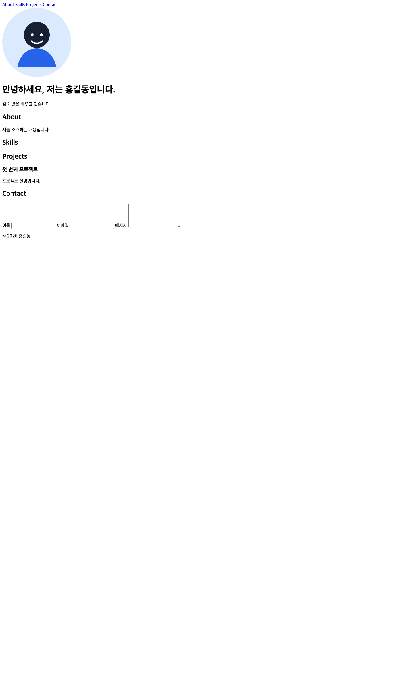
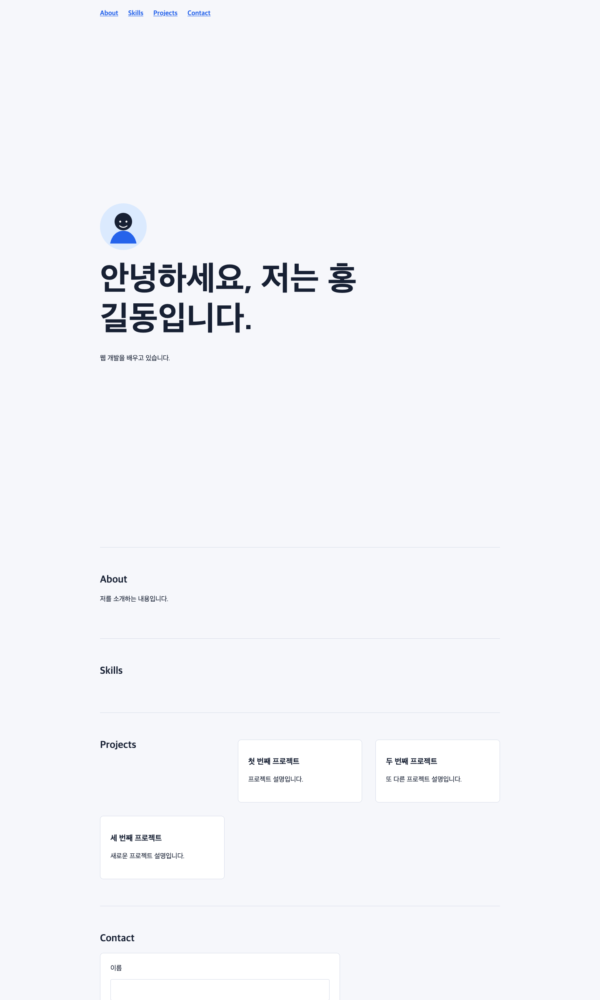
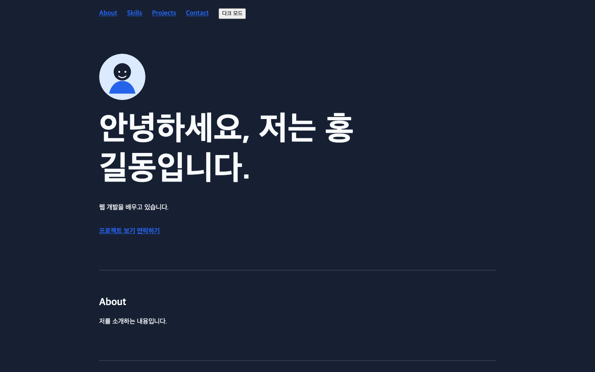

# B1-1 자기소개 웹사이트 만들기

- 발표 링크: [발표용 HTML](https://Logan-kim-the-philosopher.github.io/codyssey/B1-1/)

## 챕터

- Chapter 1. 프로젝트 구조와 시맨틱 HTML 뼈대
- Chapter 2. 챕터 2: CSS 스타일링과 반응형 레이아웃
- Chapter 3. 챕터 3: DOM 선택과 이벤트 기반 인터랙션
- Chapter 4. 챕터 4: 다크 모드 상태와 localStorage 유지
- Chapter 5. 챕터 5: Contact 폼 검증과 오류/성공 렌더링
- Chapter 6. 챕터 6: GitHub API 데이터 불러오기
- Chapter 7. 챕터 7: 보너스 프로젝트 필터링
- Chapter 8. 챕터 10: 타이핑 효과
- Chapter 9. 챕터 7: 보너스 프로젝트 필터링
- Chapter 10. 챕터 11: 보너스 폼 실제 전송
- Chapter 11. 챕터 12: 보너스 시스템 다크 모드 감지

## 실습 로그

## Chapter 1. 프로젝트 구조와 시맨틱 HTML 뼈대

### 테마

- 시맨틱 태그로 Hero/About/Skills/Projects/Contact/Footer 구성
- label for-id와 required/type 입력 검증
- img alt 대체 텍스트
- 프로필 이미지 표시 스타일
- Hero CTA와 Footer 링크 구조 보완
- Footer 소셜 링크 구조 보완

### 시맨틱 태그로 Hero/About/Skills/Projects/Contact/Footer 구성

`index.html`

#### 추가된 코드

```html
<!doctype html>
<html lang="ko">
  <head>
    <meta charset="UTF-8">
    <meta name="viewport" content="width=device-width, initial-scale=1.0">
    <title>나를 소개하는 웹페이지</title>
    <link rel="stylesheet" href="css/style.css">
    <script src="js/main.js" defer></script>
  </head>
  <body>
    <header>
      <nav aria-label="주요 메뉴">
        <a href="#about">About</a>
        <a href="#skills">Skills</a>
        <a href="#projects">Projects</a>
        <a href="#contact">Contact</a>
      </nav>
    </header>

    <main>
      <section id="hero">
        <h1>안녕하세요, 저는 홍길동입니다.</h1>
        <p>웹 개발을 배우고 있습니다.</p>
      </section>

      <section id="about">
        <h2>About</h2>
        <p>저를 소개하는 내용입니다.</p>
      </section>

      <section id="skills">
        <h2>Skills</h2>
      </section>

      <section id="projects">
        <h2>Projects</h2>
        <article>
          <h3>첫 번째 프로젝트</h3>
          <p>프로젝트 설명입니다.</p>
        </article>
      </section>

      <section id="contact">
        <h2>Contact</h2>
        <form>
          <label for="name">이름</label>
          <input id="name" name="name" type="text">
        </form>
      </section>
    </main>

    <footer>
      <p>&copy; 2026 홍길동</p>
    </footer>
  </body>
</html>
```

### label for-id와 required/type 입력 검증

`index.html`

#### 삭제된 코드

```HTML
          <input id="name" name="name" type="text">
```

#### 추가된 코드

```HTML
          <input id="name" name="name" type="text" required>

          <label for="email">이메일</label>
          <input id="email" name="email" type="email" required>

          <label for="message">메시지</label>
          <textarea id="message" name="message" rows="5" required></textarea>
```

### img alt 대체 텍스트

`index.html`

#### 추가된 코드

```HTML
        
```

### 프로필 이미지 표시 스타일

`css/style.css`

#### 추가된 코드

```CSS

#hero img {
  width: 7rem;
  aspect-ratio: 1;
  margin-bottom: 1.5rem;
  border-radius: 50%;
}
```

### Hero CTA와 Footer 링크 구조 보완

`index.html`

#### 삭제된 코드

```html
        <p id="typing-text" data-text="웹 개발을 배우고 있습니다." aria-live="polite">웹 개발을 배우고 있습니다.</p>
```

#### 추가된 코드

```html
        <p>웹 개발을 배우고 있습니다.</p>
        <p>
          <a href="#projects">프로젝트 보기</a>
          <a href="#contact">연락하기</a>
        </p>
```

`index.html`

#### 추가된 코드

```html
      <p>
        <a href="https://github.com/Logan-kim-the-philosopher">GitHub</a>
      </p>
```

### Footer 소셜 링크 구조 보완

`index.html`

#### 추가된 코드

```HTML
        <a href="https://www.linkedin.com/in/hong-gildong">LinkedIn</a>
```

### 증빙



`evidence/chapter-1-html-complete.png`


## Chapter 2. 챕터 2: CSS 스타일링과 반응형 레이아웃

### 테마

- CSS 변수와 기본 레이아웃 연결
- Grid auto-fit/minmax 카드 레이아웃
- 768px/1024px 반응형 규칙
- 다크 테마 토큰
- 프로젝트 카드 HTML 요소 추가
- 카드와 버튼의 hover 시각 피드백 보완

### CSS 변수와 기본 레이아웃 연결

`css/style.css`

#### 추가된 코드

```CSS
:root {
  --color-bg: #f6f7fb;
  --color-surface: #ffffff;
  --color-text: #172033;
  --color-muted: #667085;
  --color-accent: #2563eb;
  --color-border: #d9deea;
  --content-width: 960px;
  --space-section: 5rem;
  font-family: "Pretendard", "Apple SD Gothic Neo", sans-serif;
  color: var(--color-text);
  background: var(--color-bg);
}
...
* {
  box-sizing: border-box;
}

html {
  scroll-behavior: smooth;
}

body {
  margin: 0;
  line-height: 1.6;
}

header,
main,
footer {
  width: min(100% - 2rem, var(--content-width));
  margin-inline: auto;
}

header {
  padding-block: 1.25rem;
}

nav {
  display: flex;
  flex-wrap: wrap;
  gap: 1rem 1.5rem;
}

a {
  color: var(--color-accent);
  font-weight: 700;
}

section {
  padding-block: var(--space-section);
  border-bottom: 1px solid var(--color-border);
}

#hero {
  min-height: 55vh;
  display: grid;
  align-content: center;
}

...

h1,
h2,
h3 {
  line-height: 1.2;
}

h1 {
  max-width: 12ch;
  margin-block: 0 1rem;
  font-size: clamp(2.5rem, 8vw, 5rem);
}

h2 {
  margin-top: 0;
}

article,
form {
  padding: 1.5rem;
  background: var(--color-surface);
  border: 1px solid var(--color-border);
  border-radius: 8px;
}

form {
  display: grid;
  gap: 0.75rem;
  max-width: 36rem;
}

input,
textarea {
  width: 100%;
  padding: 0.75rem;
  font: inherit;
  border: 1px solid var(--color-border);
  border-radius: 4px;
}

footer {
  padding-block: 2rem;
  color: var(--color-muted);
}
```

### Grid auto-fit/minmax 카드 레이아웃

`css/style.css`

#### 추가된 코드

```CSS
#projects {
  display: grid;
  grid-template-columns: repeat(auto-fit, minmax(240px, 1fr));
  gap: 1.5rem;
}
```

### 768px/1024px 반응형 규칙

`css/style.css`

#### 추가된 코드

```CSS

@media (min-width: 768px) {
  header,
  main,
  footer {
    width: min(100% - 4rem, var(--content-width));
  }

  #hero {
    min-height: 65vh;
  }

  #projects {
    gap: 2rem;
  }
}

@media (min-width: 1024px) {
  section {
    padding-block: 7rem;
  }

  #hero h1 {
    font-size: 5rem;
  }
}
```

### 다크 테마 토큰

`css/style.css`

#### 추가된 코드

```css
[data-theme="dark"] {
  --color-bg: #172033;
  --color-surface: #24324a;
  --color-text: #f8fafc;
  --color-muted: #cbd5e1;
  --color-border: #475569;
}
```

### 프로젝트 카드 HTML 요소 추가

`index.html`

#### 삭제된 코드

```html
      <p>
        <a href="https://github.com/Logan-kim-the-philosopher">GitHub</a>
        <a href="https://www.linkedin.com/in/hong-gildong">LinkedIn</a>
      </p>
```

#### 추가된 코드

```html
        <article>
          <h3>두 번째 프로젝트</h3>
          <p>또 다른 프로젝트 설명입니다.</p>
        </article>
        <article>
          <h3>세 번째 프로젝트</h3>
          <p>새로운 프로젝트 설명입니다.</p>
        </article>
```

### 카드와 버튼의 hover 시각 피드백 보완

`css/style.css`

#### 추가된 코드

```CSS
  box-shadow: 0 8px 24px rgba(23, 32, 51, 0.08);
...
article,
button {
  transition: transform 0.2s ease, box-shadow 0.2s ease;
}

article:hover,
button:hover {
  transform: translateY(-2px);
  box-shadow: 0 10px 24px rgba(23, 32, 51, 0.14);
}
```

### 증빙



`evidence/chapter-2-css-responsive.png`


## Chapter 3. 챕터 3: DOM 선택과 이벤트 기반 인터랙션

### 테마

- querySelector 선택과 DOM 참조 만들기
- classList.toggle active 메뉴 상태 전환
- scroll 이벤트와 60px/300px 스크롤 기준 확인
- scroll 이벤트와 60px/300px 스크롤 기준 상태 전환
- IntersectionObserver threshold 0.2 섹션 등장 효과
- 햄버거 버튼과 nav active 메뉴 상태 전환
- 스크롤 탑 버튼 HTML 구조 추가
- 스크롤 탑 버튼 표시와 최상단 이동
- IntersectionObserver visible 클래스와 섹션 등장 애니메이션
- 메뉴 링크의 preventDefault와 부드러운 섹션 이동

### querySelector 선택과 DOM 참조 만들기

`js/main.js`

#### 추가된 코드

```javascript
const navigation = document.querySelector("nav");
const navigationLinks = document.querySelectorAll("nav a");
const projectsSection = document.querySelector("#projects");

console.log(navigation);
console.log(navigationLinks.length);
console.log(projectsSection);
```

### querySelector 선택과 DOM 참조 만들기

`js/main.js`

#### 추가된 코드

```javascript

navigationLinks.forEach((link) => {
  link.addEventListener("click", (event) => {
    console.log(`${link.textContent} 메뉴를 클릭했습니다.`);
  });
});
```

### querySelector 선택과 DOM 참조 만들기

```bash
$ "/Applications/Google Chrome.app/Contents/MacOS/Google Chrome" --headless=new --dump-dom /tmp/b1-1-console-click-check.html
NAV
4
SECTION projects
About 메뉴를 클릭했습니다.
```

### classList.toggle active 메뉴 상태 전환

`js/main.js`

#### 삭제된 코드

```javascript
    console.log(`${link.textContent} 메뉴를 클릭했습니다.`);
```

#### 추가된 코드

```javascript
    event.preventDefault();
    link.classList.toggle("active");
    console.log(`${link.textContent} 메뉴 active 상태: ${link.classList.contains("active")}`);
```

```bash
$ chrome --headless=new --dump-dom /tmp/b1-1-toggle-check.html
NAV
4
SECTION projects
About 메뉴 active 상태: true
About 메뉴 active 상태: false
```

### scroll 이벤트와 60px/300px 스크롤 기준 확인

`js/main.js`

#### 추가된 코드

```javascript

window.addEventListener("scroll", () => {
  console.log(`현재 스크롤 위치: ${window.scrollY}px`);
});
```

### scroll 이벤트와 60px/300px 스크롤 기준 상태 전환

`js/main.js`

#### 추가된 코드

```javascript
const isScrolled = window.scrollY >= 60;
const passedHero = window.scrollY >= 300;

navigation.classList.toggle("scrolled", isScrolled);
document.body.classList.toggle("passed-hero", passedHero);

console.log(`scrolled: ${isScrolled}, passedHero: ${passedHero}`);
```

### IntersectionObserver threshold 0.2 섹션 등장 효과

`js/main.js`

#### 추가된 코드

```javascript

const sections = document.querySelectorAll("main section");

const observer = new IntersectionObserver(
  (entries) => {
    entries.forEach((entry) => {
      if (entry.isIntersecting) {
        entry.target.classList.add("visible");
        observer.unobserve(entry.target);
      }
    });
  },
  { threshold: 0.2 },
);

sections.forEach((section) => {
  observer.observe(section);
});
```

### 햄버거 버튼과 nav active 메뉴 상태 전환

`index.html`

#### 추가된 코드

```html
      <button id="menu-toggle" type="button" aria-label="메뉴 열기" aria-expanded="false" aria-controls="main-nav">
        ☰
      </button>
```

`css/style.css`

#### 추가된 코드

```css

#menu-toggle {
  margin-bottom: 1rem;
}

@media (max-width: 767px) {
  nav {
    display: none;
  }

  nav.active {
    display: flex;
  }
}

@media (min-width: 768px) {
  #menu-toggle {
    display: none;
  }
}
```

`js/main.js`

#### 추가된 코드

```javascript

const menuToggle = document.querySelector("#menu-toggle");

menuToggle.addEventListener("click", () => {
  const isOpen = navigation.classList.toggle("active");
  menuToggle.setAttribute("aria-expanded", String(isOpen));
});
```

### 스크롤 탑 버튼 HTML 구조 추가

`index.html`

#### 추가된 코드

```html
    <button id="top-button" type="button" aria-label="맨 위로 이동">
      ↑
    </button>

```

### 스크롤 탑 버튼 표시와 최상단 이동

`css/style.css`

#### 추가된 코드

```css

#top-button {
  position: fixed;
  right: 1rem;
  bottom: 1rem;
  display: none;
}

body.passed-hero #top-button {
  display: block;
}
```

`js/main.js`

#### 추가된 코드

```javascript

topButton.addEventListener("click", () => {
  window.scrollTo({ top: 0, behavior: "smooth" });
});
```

### IntersectionObserver visible 클래스와 섹션 등장 애니메이션

`css/style.css`

#### 추가된 코드

```css

main section {
  opacity: 0;
  transform: translateY(1rem);
  transition: opacity 0.4s ease, transform 0.4s ease;
}

main section.visible {
  opacity: 1;
  transform: translateY(0);
}
```

### 메뉴 링크의 preventDefault와 부드러운 섹션 이동

`js/main.js`

#### 추가된 코드

```javascript

    const target = document.querySelector(link.getAttribute("href"));
    target.scrollIntoView({ behavior: "smooth" });
```


## Chapter 4. 챕터 4: 다크 모드 상태와 localStorage 유지

### 테마

- 테마 버튼 HTML 구조 추가
- theme-toggle 클릭과 data-theme 상태 전환
- localStorage 테마 저장과 새로고침 복원

### 테마 버튼 HTML 구조 추가

`index.html`

#### 추가된 코드

```html
        <button id="theme-toggle" type="button">다크 모드</button>
```

### theme-toggle 클릭과 data-theme 상태 전환

`js/main.js`

#### 추가된 코드

```javascript

const themeToggle = document.querySelector("#theme-toggle");

themeToggle.addEventListener("click", () => {
  const isDark = document.documentElement.dataset.theme === "dark";
  document.documentElement.dataset.theme = isDark ? "light" : "dark";
});
```

### localStorage 테마 저장과 새로고침 복원

`js/main.js`

#### 추가된 코드

```javascript

const savedTheme = localStorage.getItem("theme") || "light";
document.documentElement.dataset.theme = savedTheme;

```


## Chapter 5. 챕터 5: Contact 폼 검증과 오류/성공 렌더링

### 테마

- Contact 폼 submit 버튼 구조 추가
- submit preventDefault 폼 이벤트 연결
- aria-live 폼 상태 메시지 영역
- 필수값과 이메일 형식 검증 메시지
- input 이벤트와 이메일 형식 실시간 메시지

### Contact 폼 submit 버튼 구조 추가

`index.html`

#### 추가된 코드

```html
          <button type="submit">보내기</button>
```

### submit preventDefault 폼 이벤트 연결

`js/main.js`

#### 추가된 코드

```javascript

const contactForm = document.querySelector("#contact form");

contactForm.addEventListener("submit", (event) => {
  event.preventDefault();

  console.log("Contact 폼 제출 이벤트가 실행되었습니다.");
});
```

### aria-live 폼 상태 메시지 영역

`index.html`

#### 추가된 코드

```html
          <p id="form-status" role="status" aria-live="polite"></p>
```

### 필수값과 이메일 형식 검증 메시지

`js/main.js`

#### 추가된 코드

```javascript

const formStatus = document.querySelector("#form-status");

  const formData = new FormData(contactForm);
  const name = formData.get("name").trim();
  const email = formData.get("email").trim();
  const message = formData.get("message").trim();

  if (!name || !email || !message) {
    formStatus.textContent = "모든 필드를 입력해주세요.";
    return;
  }

  if (!email.includes("@")) {
    formStatus.textContent = "올바른 이메일을 입력해주세요.";
    return;
  }

  formStatus.textContent = "입력이 올바르게 확인되었습니다.";
```

### input 이벤트와 이메일 형식 실시간 메시지

`js/main.js`

#### 추가된 코드

```javascript

const emailInput = document.querySelector("#email");

emailInput.addEventListener("input", () => {
  if (emailInput.value && !emailInput.value.includes("@")) {
    formStatus.textContent = "이메일 형식을 확인해주세요.";
    return;
  }

  formStatus.textContent = "";
});
```


## Chapter 6. 챕터 6: GitHub API 데이터 불러오기

### 테마

- fetch와 async/await로 GitHub 저장소 요청 만들기
- map과 innerHTML로 저장소 카드 렌더링하기
- loading success error empty 상태 분기하기
- 브라우저에서 API 상태 UI 확인하기
- 실제 GitHub 사용자명으로 API 대상 바꾸기
- GitHub API 에러 재시도 버튼
- GitHub API 요청 함수 재사용

### fetch와 async/await로 GitHub 저장소 요청 만들기

`js/main.js`

#### 추가된 코드

```javascript

const githubUsername = "octocat";

async function fetchRepositories() {
  const apiUrl = `https://api.github.com/users/${githubUsername}/repos`;

  try {
    const response = await fetch(apiUrl);

    if (!response.ok) {
      throw new Error(`GitHub API 응답 오류: ${response.status}`);
    }

    const repositories = await response.json();
    console.log("GitHub 저장소를 불러왔습니다.", repositories.length);
    return repositories;
  } catch (error) {
    console.error("GitHub 저장소를 불러오지 못했습니다.", error);
    return [];
  }
}

fetchRepositories();
```

### map과 innerHTML로 저장소 카드 렌더링하기

`index.html`

#### 삭제된 코드

```html
        <article>
          <h3>첫 번째 프로젝트</h3>
          <p>프로젝트 설명입니다.</p>
        </article>
        <article>
          <h3>두 번째 프로젝트</h3>
          <p>또 다른 프로젝트 설명입니다.</p>
        </article>
        <article>
          <h3>세 번째 프로젝트</h3>
          <p>새로운 프로젝트 설명입니다.</p>
        </article>
```

#### 추가된 코드

```html
        <p id="projects-status">GitHub 저장소를 불러오는 중입니다.</p>
        <div id="project-list" aria-live="polite"></div>
```

`css/style.css`

#### 삭제된 코드

```css
#projects {
```

#### 추가된 코드

```css
#project-list {
```

`css/style.css`

#### 삭제된 코드

```css
  #projects {
```

#### 추가된 코드

```css
  #project-list {
```

`js/main.js`

#### 추가된 코드

```javascript
const projectList = document.querySelector("#project-list");
const projectsStatus = document.querySelector("#projects-status");
```

`js/main.js`

#### 삭제된 코드

```javascript
fetchRepositories();
```

#### 추가된 코드

```javascript
function renderRepositories(repositories) {
  if (!repositories.length) {
    projectsStatus.textContent = "표시할 GitHub 저장소가 없습니다.";
    projectList.innerHTML = "";
    return;
  }

  projectsStatus.textContent = `${repositories.length}개의 GitHub 저장소를 불러왔습니다.`;
  projectList.innerHTML = repositories
    .map((repository) => {
      const description = repository.description || "설명이 등록되지 않은 저장소입니다.";

      return `
        <article>
          <h3>${repository.name}</h3>
          <p>${description}</p>
          <a href="${repository.html_url}">저장소 보기</a>
        </article>
      `;
    })
    .join("");
}

fetchRepositories().then(renderRepositories);
```

### loading success error empty 상태 분기하기

`js/main.js`

#### 삭제된 코드

```javascript
    return repositories;
...
    return [];
...
function renderRepositories(repositories) {
```

#### 추가된 코드

```javascript
    return { status: "success", repositories };
...
    return { status: "error", repositories: [], message: error.message };
...
function renderRepositories(result) {
  const { status, repositories, message } = result;

  if (status === "error") {
    projectsStatus.textContent = `GitHub 저장소를 불러오지 못했습니다. ${message}`;
    projectList.innerHTML = "";
    return;
  }
```

### 실제 GitHub 사용자명으로 API 대상 바꾸기

`js/main.js`

#### 삭제된 코드

```javascript
const githubUsername = "octocat";
```

#### 추가된 코드

```javascript
const githubUsername = "Logan-kim-the-philosopher";
```

### GitHub API 에러 재시도 버튼

`js/main.js`

#### 삭제된 코드

```JavaScript
    projectList.innerHTML = "";
```

#### 추가된 코드

```JavaScript
    projectList.innerHTML = '<button id="projects-retry" type="button">다시 시도</button>';
    document.querySelector("#projects-retry").addEventListener("click", loadRepositories);
```

### GitHub API 요청 함수 재사용

`js/main.js`

#### 삭제된 코드

```JavaScript
fetchRepositories().then((result) => {
  if (result.status === "success") {
    allRepositories = result.repositories;
  }

  renderRepositories(result);
});
```

#### 추가된 코드

```JavaScript
async function loadRepositories() {
  projectsStatus.textContent = "GitHub 저장소를 불러오는 중입니다.";
  projectList.innerHTML = "";

  const result = await fetchRepositories();

  if (result.status === "success") {
    allRepositories = result.repositories;
  }

  renderRepositories(result);
}

loadRepositories();
```


## Chapter 7. 챕터 7: 보너스 프로젝트 필터링

### 테마

- label과 search input으로 필터 UI 만들기
- input 이벤트와 filter로 저장소 목록 걸러내기

### label과 search input으로 필터 UI 만들기

`css/style.css`

#### 추가된 코드

```css
#project-filter {
  max-width: 24rem;
  margin-bottom: 1rem;
}
```

### input 이벤트와 filter로 저장소 목록 걸러내기

`js/main.js`

#### 추가된 코드

```javascript
const projectFilter = document.querySelector("#project-filter");
let allRepositories = [];
```

`js/main.js`

#### 삭제된 코드

```javascript
fetchRepositories().then(renderRepositories);
```

#### 추가된 코드

```javascript
function filterRepositories() {
  const keyword = projectFilter.value.trim().toLowerCase();
  const filteredRepositories = allRepositories.filter((repository) =>
    repository.name.toLowerCase().includes(keyword),
  );

  renderRepositories({ status: "success", repositories: filteredRepositories });
}

projectFilter.addEventListener("input", filterRepositories);

fetchRepositories().then((result) => {
  if (result.status === "success") {
    allRepositories = result.repositories;
  }

  renderRepositories(result);
});
```


## Chapter 8. 챕터 10: 타이핑 효과

### 테마

- Hero 문장에 타이핑 대상 요소 준비
- Hero 문장을 한 글자씩 표시하는 타이핑 로직

### Hero 문장에 타이핑 대상 요소 준비

`index.html`

#### 삭제된 코드

```html
        <p>웹 개발을 배우고 있습니다.</p>
```

#### 추가된 코드

```html
        <p id="typing-text" data-text="웹 개발을 배우고 있습니다." aria-live="polite">웹 개발을 배우고 있습니다.</p>
```

### Hero 문장을 한 글자씩 표시하는 타이핑 로직

`js/main.js`

#### 추가된 코드

```javascript
const typingText = document.querySelector("#typing-text");

if (typingText) {
  const text = typingText.dataset.text;
  let index = 0;

  typingText.textContent = "";

  const typeNextCharacter = () => {
    if (index >= text.length) return;

    typingText.textContent += text[index];
    index += 1;
    setTimeout(typeNextCharacter, 80);
  };

  typeNextCharacter();
}
```


## Chapter 9. 챕터 7: 보너스 프로젝트 필터링

### 테마

- 언어 필터 입력 UI 구조 추가
- 이름과 언어 조건을 함께 적용하는 filter 연결

### 언어 필터 입력 UI 구조 추가

`index.html`

#### 삭제된 코드

```HTML
        <input id="project-filter" name="project-filter" type="search" placeholder="저장소 이름 검색">
```

#### 추가된 코드

```HTML
        <input id="project-filter" name="project-filter" type="search" placeholder="저장소 이름 검색">
        <label for="language-filter">언어 필터</label>
        <select id="language-filter" name="language-filter">
          <option value="">모든 언어</option>
          <option value="JavaScript">JavaScript</option>
          <option value="HTML">HTML</option>
          <option value="CSS">CSS</option>
        </select>
```

### 이름과 언어 조건을 함께 적용하는 filter 연결

`js/main.js`

#### 추가된 코드

```JavaScript
const languageFilter = document.querySelector("#language-filter");
```

`js/main.js`

#### 삭제된 코드

```JavaScript
    repository.name.toLowerCase().includes(keyword),
```

#### 추가된 코드

```JavaScript
  const language = languageFilter.value;
...
    repository.name.toLowerCase().includes(keyword) &&
    (!language || repository.language === language),
```

`js/main.js`

#### 추가된 코드

```JavaScript
languageFilter.addEventListener("change", filterRepositories);
```


## Chapter 10. 챕터 11: 보너스 폼 실제 전송

### 테마

- Contact 폼 실제 전송 속성 추가
- Formspree 실제 endpoint 연결
- 검증 성공 시 Formspree POST 허용

### Contact 폼 실제 전송 속성 추가

`index.html`

#### 삭제된 코드

```HTML
        <form>
```

#### 추가된 코드

```HTML
        <form action="https://formspree.io/f/your-form-id" method="POST">
```

### Formspree 실제 endpoint 연결

`index.html`

#### 삭제된 코드

```HTML
        <form action="https://formspree.io/f/your-form-id" method="POST">
```

#### 추가된 코드

```HTML
        <form action="https://formspree.io/f/mqpkrzyv" method="POST">
```

### 검증 성공 시 Formspree POST 허용

`js/main.js`

#### 삭제된 코드

```JavaScript
contactForm.addEventListener("submit", (event) => {
  event.preventDefault();

  const formData = new FormData(contactForm);
```

#### 추가된 코드

```JavaScript
contactForm.addEventListener("submit", (event) => {
  const formData = new FormData(contactForm);
```

`js/main.js`

#### 추가된 코드

```JavaScript
    event.preventDefault();
```

`js/main.js`

#### 추가된 코드

```JavaScript
    event.preventDefault();
```


## Chapter 11. 챕터 12: 보너스 시스템 다크 모드 감지

### 테마

- 시스템 다크 모드 감지와 저장 테마 우선순위

### 시스템 다크 모드 감지와 저장 테마 우선순위

`js/main.js`

#### 삭제된 코드

```JavaScript
const savedTheme = localStorage.getItem("theme") || "light";
```

#### 추가된 코드

```JavaScript
const systemTheme = window.matchMedia("(prefers-color-scheme: dark)").matches ? "dark" : "light";
const savedTheme = localStorage.getItem("theme") || systemTheme;
```

### 증빙



`artifacts/b1-1/logs/screenshots/final-dark-mode.png`


